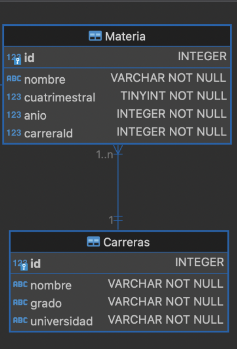

# Estrellas Y Código

## Integrantes

- Cardoso Eliana Natasha
- Cantarino Clara


### Comandos necesarios para instalar y ejecutar la Api:
```npm install express```

```npm install joi```

```npm run dev```

### ¿Cómo armamos la estructura?
Basandonos en el siguiente diagrama:



Armamos un archivo json en la carpeta data, ya que no se conecta a una base de datos. Este archivo tiene una estructura donde tenemos un array, y dentro de este tenemos anidadas las carreras, las cuales a su vez tienen materias asociadas en un array de objetos ya que son muchas materias por cada carrera.

```[
    {
        "Carrera":{
          "id": 1,
          "nombre": "Tecnicatura en tecnologias industriales",
          "grado": "Tecnicatura",
          "universidad": "UNPAZ",
          "materias":[
            {
                "id": 1,
                "nombre": "Tecnología y Sociedad",
                "cuatrimestral": 1,
                "anio": 1,
                "carreraId": 1
            },
            {
                "id": 2,
                "nombre": "Inglés I",
                "cuatrimestral": 1,
                "anio": 1,
                "carreraId": 1
            },
            {
                "id": 3,
                "nombre": "Matemática I",
                "cuatrimestral": 1,
                "anio": 1,
                "carreraId": 1
            },
            {
                "id": 4,
                "nombre": "Informatica",
                "cuatrimestral": 1,
                "anio": 1,
                "carreraId": 1
            },
            {
                "id": 5,
                "nombre": "Mecánica",
                "cuatrimestral": 1,
                "anio": 1,
                "carreraId": 1
            },
            {
                "id": 6,
                "nombre": "Electricidad y electrónica",
                "cuatrimestral": 1,
                "anio": 1,
                "carreraId": 1
            },
            {
                "id": 7,
                "nombre": "Matemática II",
                "cuatrimestral": 1,
                "anio": 1,
                "carreraId": 1
            }
        ]
          }
    }
]```


